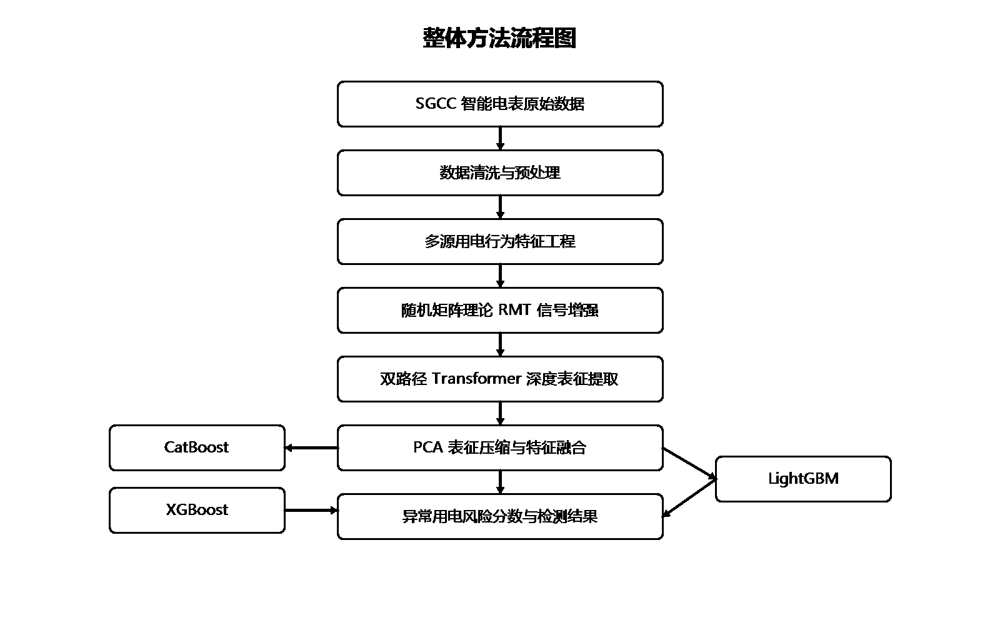
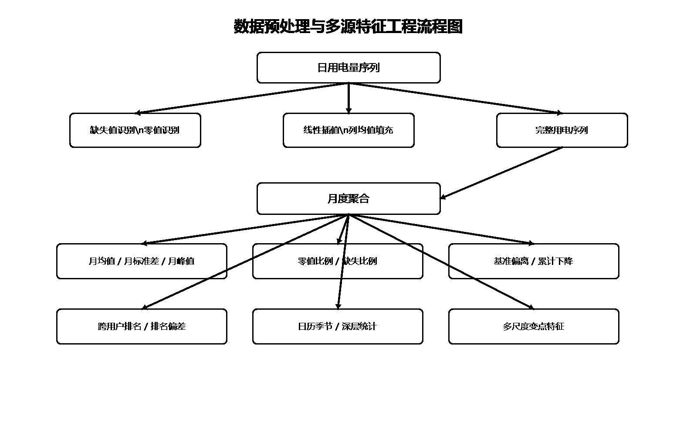
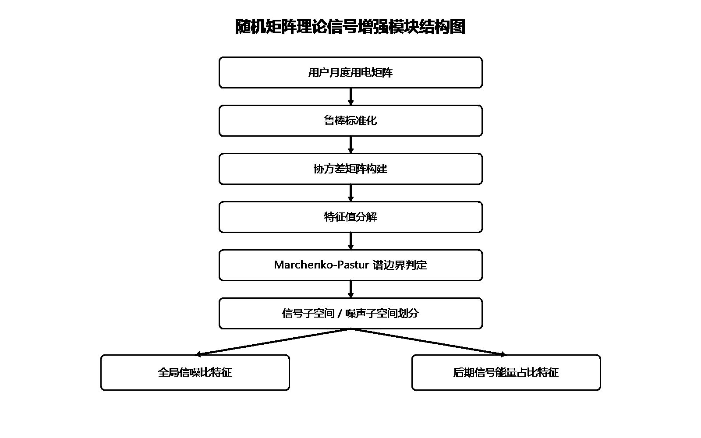
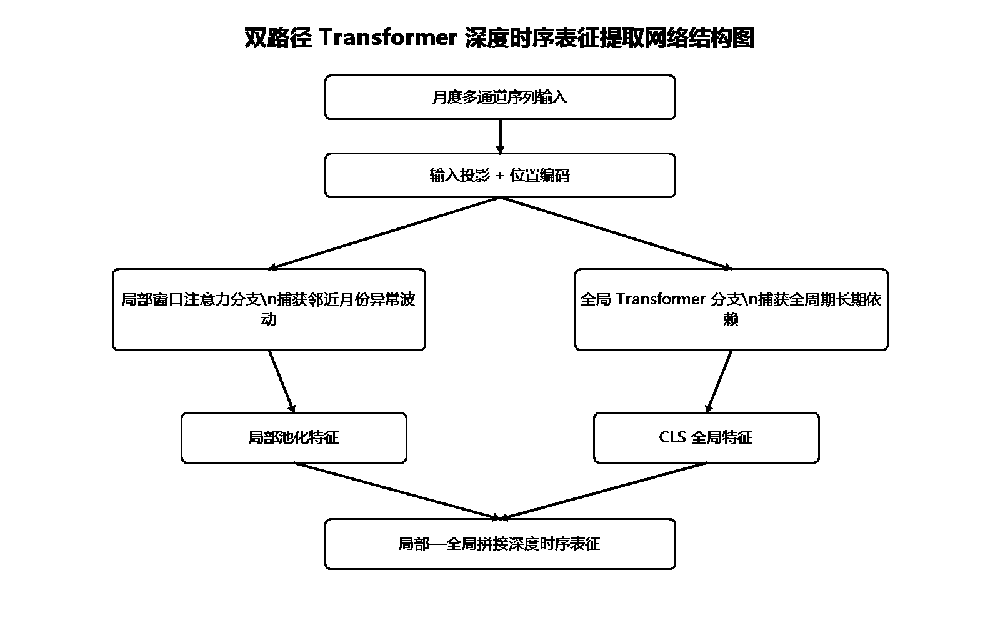
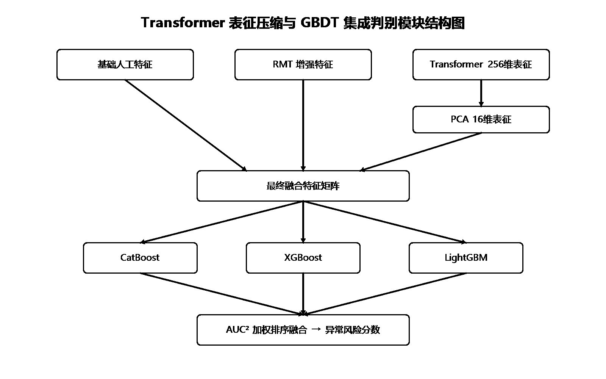
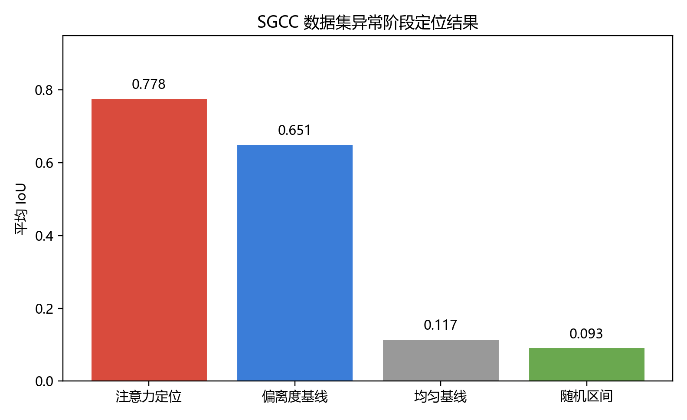
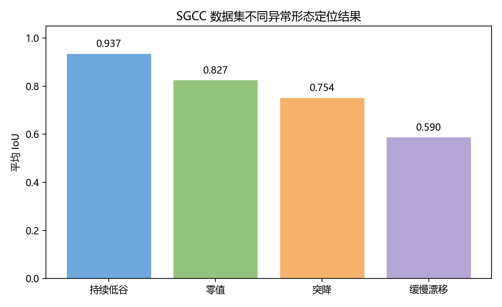
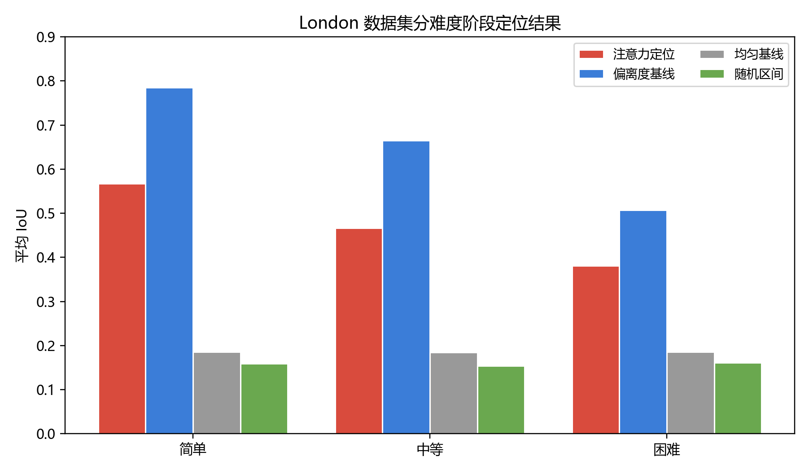
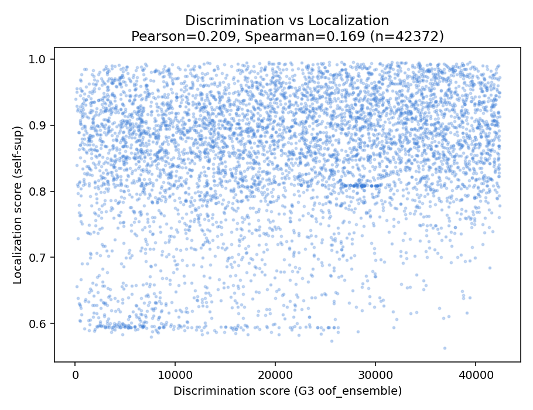
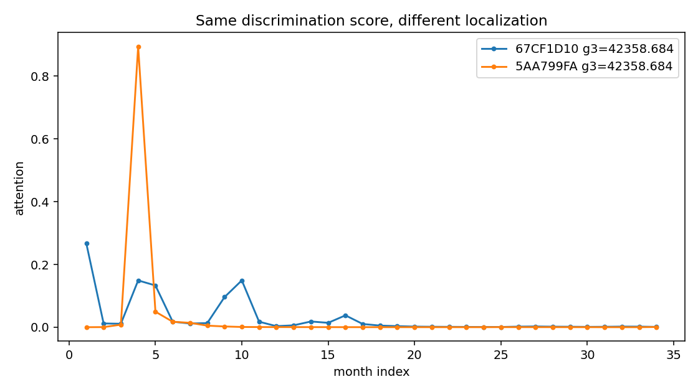

# 基于监督判别与自监督正常模式建模的智能电表异常用电检测方法研究

## 摘要

智能电表能够连续记录用户的用电行为，为异常用电检测提供了细粒度数据。传统人工稽查主要依赖经验判断和抽样检查，面对大规模居民及工商业用户时，很难兼顾覆盖率和准确性。现有数据驱动方法多将异常用电检测建模为用户级二分类问题，即根据历史用电序列判断某一用户是否存在异常。这类方法可以给出异常风险分数，但通常无法指出异常发生的具体时段。对于现场稽查而言，仅知道用户“可疑”还不够，还需要知道“从什么时候开始可疑”。

针对上述问题，本文将智能电表异常用电检测拆分为两个相互独立但可协同使用的研究任务：用户级异常判别和异常阶段定位。用户级异常判别回答“谁异常”，异常阶段定位回答“异常发生在哪个阶段”。二者并非同一任务的重复表达。判别模块使用真实用户级标签训练，学习异常用户与正常用户之间的判别边界；定位模块不使用真实异常标签，而是通过自监督正常模式建模和合成注入构造月级监督信号，学习用户自身时间轴上的异常偏离位置。

在用户级异常判别方面，本文提出基于随机矩阵理论、双路径 Transformer 和梯度提升树集成的监督判别方法。首先将用户日用电序列聚合为月度多通道序列，并提取缺失、零值、趋势、排名、季节性和多尺度变点等多源特征；然后利用随机矩阵理论分析用户群体协方差结构，提取信号子空间能量特征；再通过双路径 Transformer 分别学习局部突变和全局趋势表征；最后采用 CatBoost、XGBoost 和 LightGBM 的加权秩融合输出异常风险分数。在 SGCC 数据集上，该方法折外 AUC 达到 0.875983，F1 值达到 0.516921；在 London Smart Meters 数据集的简单、中等、困难三档合成异常场景下，AUC 分别达到 0.9965、0.9809 和 0.9139。

在异常阶段定位方面，本文提出基于自监督正常用电模式建模的纯自监督定位方法。该方法先利用掩码重构和未来窗口预测学习正常用电流形，再根据平均偏离度构造伪正常用户池，并在伪正常用户上注入已知月份的合成异常，得到月级真值训练注意力定位头。由于训练过程中不使用真实异常标签，该定位方法与监督判别方法在监督信号上完全独立。在 SGCC 数据集上，5 个随机种子实验显示，注意力定位平均交并比为 0.778，95% 置信区间为 [0.752, 0.805]，点调整 F1 为 0.861；持续低谷、零值、突降和缓慢漂移四类异常的平均交并比分别为 0.937、0.827、0.754 和 0.590。在 London 数据集上，简单、中等、困难三档短窗口合成异常的注意力定位交并比分别为 0.567、0.466 和 0.382，均高于随机区间和均匀基线。

为说明判别与定位不是同一件事，本文进一步进行了正交性分析。SGCC 全体 42372 名用户上，判别分与定位分的 Pearson 相关系数为 0.209，Spearman 相关系数为 0.169；判别分与定位区间置信度的 Pearson 相关系数为 0.107。判别模块输出用户级标量，时间维为 0；定位模块输出逐月注意力分布，SGCC 上时间维为 34。实验说明，判别模块解决用户筛查问题，定位模块补充时间证据，二者提供的信息不同，具有并行研究价值。

关键词：异常用电检测；智能电表；随机矩阵理论；Transformer；自监督学习；异常阶段定位

## Abstract

Smart meters record long-term electricity consumption and provide detailed data for abnormal electricity usage detection. Most existing methods formulate this task as a user-level binary classification problem. They can rank suspicious users, but they usually cannot indicate when the abnormal behavior occurs. In field inspection, a risk score alone is not enough. Inspectors also need temporal clues.

This thesis studies two related but different tasks: user-level abnormality discrimination and abnormal stage localization. The discrimination module answers who is abnormal. The localization module answers when the abnormal behavior appears. The former is trained with real user-level labels, while the latter does not use real abnormal labels. Instead, it learns normal consumption patterns through self-supervised tasks and trains an attention localization head with synthetic month-level labels generated by injected anomalies.

For user-level discrimination, this thesis proposes a supervised framework based on random matrix theory, dual-path Transformer representation, and gradient boosting ensemble. Multi-source features are extracted from monthly consumption sequences. Random matrix theory is used to obtain signal subspace energy features from the population covariance structure. A dual-path Transformer learns both local changes and global trends. CatBoost, XGBoost, and LightGBM are combined by weighted rank fusion. On the SGCC dataset, the method achieves an OOF AUC of 0.875983 and an F1 score of 0.516921. On the London Smart Meters dataset under Easy, Medium, and Hard synthetic anomaly settings, the AUC values are 0.9965, 0.9809, and 0.9139.

For abnormal stage localization, this thesis proposes a fully self-supervised normal-pattern modeling method. The model first learns a normal consumption manifold by masked reconstruction and future prediction. Then low-deviation users are selected as pseudo-normal users, and synthetic anomalies with known months are injected to generate month-level labels for training the attention localization head. On SGCC, the mean IoU over five random seeds is 0.778 with a 95% confidence interval of [0.752, 0.805], and the point-adjusted F1 score is 0.861. On London, the IoU values under Easy, Medium, and Hard synthetic settings are 0.567, 0.466, and 0.382, all higher than random and uniform baselines.

Orthogonality analysis further shows that discrimination and localization provide different information. On 42372 SGCC users, the Pearson correlation between the discrimination score and the localization score is 0.209, and the Spearman correlation is 0.169. The discrimination module outputs a user-level scalar with no temporal dimension, while the localization module outputs a monthly distribution. The two modules therefore answer different questions and can be used together in abnormal electricity usage analysis.

Key words: abnormal electricity usage detection; smart meter; random matrix theory; Transformer; self-supervised learning; stage localization

## 专用术语注释表

表 0-1 主要术语及含义

| 术语 | 含义 |
|---|---|
| SGCC | 国家电网公开异常用电数据集，含真实用户级异常标签 |
| London Smart Meters | 伦敦智能电表数据集，不含真实窃电标签，本文用于合成异常验证 |
| AUC | 曲线下面积，用于评价二分类排序能力 |
| F1 | 精确率和召回率的调和平均值 |
| IoU | 预测异常区间与真实异常区间的交并比 |
| 点调整 F1 | 只要预测命中真实连续异常段中的任意一个月，就认为该异常事件被发现后再计算 F1 |
| RMT | 随机矩阵理论，用于从群体协方差结构中提取信号子空间特征 |
| 正常流形 | 由正常或低偏离用电序列学习得到的正常行为模式空间 |
# 第一章 绪论

## 1.1 研究背景及意义

电力系统运行中，异常用电和窃电行为长期存在。传统处理方式依赖人工稽查、用户举报和营业异常记录。人工方式有经验优势，但覆盖范围有限，且稽查成本高。当用户数量达到数万甚至数十万时，仅靠人工筛查很难及时发现隐蔽异常。

智能电表的普及改变了这一局面。电表不再只是月底读数工具，而是持续记录用户日用电量甚至半小时用电量的数据源。每个用户的用电序列都留下了时间轨迹：正常生活用电通常存在季节性、工作日与周末差异、长期均值变化等规律；异常用电则可能表现为突降、持续低谷、周期性置零、长期低负荷或缓慢衰减。这些数据为自动检测提供了基础。

目前常见做法是将异常用电检测看作用户级二分类任务。模型输入用户历史用电序列，输出异常概率。这个方向直接有效，适合用于大规模用户筛查。但它也带来一个实际问题：模型可以告诉供电企业哪个用户可疑，却不能自然告诉稽查人员该查哪几个月。若一个用户三年数据中只有后半年异常，用户级分数无法直接指出这一点。现场人员仍要重新查看曲线、核对业务记录和表计事件。

因此，异常用电检测不应只停留在“用户是否异常”的层面，还应尽量给出“异常发生在哪个阶段”的线索。这个时间线索能够缩小稽查范围，也能帮助解释模型判断依据。本文正是围绕这一需求展开研究：一方面提高用户级异常判别能力，另一方面建立异常阶段定位方法，为判别结果补充时间维度。

## 1.2 国内外研究现状

### 1.2.1 基于人工特征和传统机器学习的方法

较早的异常用电检测研究主要依赖人工特征。研究人员通常从用户用电序列中提取均值、方差、峰谷差、负荷率、零值比例、连续零值长度、缺失比例、前后期用电差异、季节性统计量等指标，再使用支持向量机、随机森林、逻辑回归或梯度提升树进行分类。

这类方法优点清楚。第一，训练成本较低，对算力要求不高。第二，特征含义直观，便于向业务人员解释。第三，在标签量不大的场景中，树模型往往比复杂深度模型更稳。实际电力业务中，人工特征加树模型仍然是很常见的方案。

但它也有明显局限。人工特征依赖研究者对异常形态的预设。如果异常方式发生变化，原有特征不一定能覆盖。比如，突降和长期零值比较容易通过统计量捕捉，缓慢漂移则不明显。其次，用户之间用电规模差异很大，直接比较均值或方差容易把正常差异误判为异常。因此，仅靠人工特征难以充分表达长周期用电序列中的复杂变化。

### 1.2.2 基于深度学习的异常判别方法

近年来，卷积神经网络、循环神经网络和 Transformer 被引入智能电表异常检测。深度模型可以直接从时序数据中学习表征，减少人工特征设计的压力。尤其是 Transformer，自注意力机制能够建模较长时间范围内的月份关系，适合处理长周期用电序列。

深度学习方法提高了时序建模能力，但并没有完全解决异常用电检测中的业务问题。首先，深度判别模型仍然依赖标签。窃电标签通常来自现场核查，获取成本高，且可能存在时间滞后和噪声。其次，异常用户占比低，模型训练容易偏向正常类。再次，大多数深度判别方法输出的仍是用户级概率，无法直接给出异常月份。判别能力增强了，但时间解释仍不足。

### 1.2.3 基于无监督和自监督的正常模式建模方法

无监督和自监督方法不直接学习异常标签，而是学习正常用电模式。当某一用户或某些月份无法被正常模式解释时，模型认为其存在异常偏离。常见方法包括孤立森林、局部离群因子、自编码器、预测模型等。

这类方法适合标签稀缺场景，也更有可能发现未知形态异常。但直接使用重构误差或预测误差也有风险。误差高可能是异常，也可能来自季节变化、住户变化、缺失补全误差或正常生活波动。因此，本文没有把自监督偏离度直接当成最终定位结论，而是在合成注入得到的月级真值上训练注意力定位头，使模型学习怎样把偏离度转化为连续异常区间。

## 1.3 论文主要研究内容

本文围绕智能电表异常用电检测中的两个问题展开：用户级异常判别和异常阶段定位。参考“问题提出、方法设计、实验验证”的论文写法，本文主要研究内容如下。

（1）针对用户级异常判别问题，提出基于随机矩阵理论与双路径 Transformer 的监督判别方法。该方法首先构建月度多通道用电序列，提取用户自身统计、跨用户排名、缺失零值行为、季节性变化和多尺度变点等特征；然后利用随机矩阵理论从用户群体协方差结构中提取信号能量特征；再设计局部窗口注意力和全局自注意力两条路径，分别学习短期突变和长期趋势；最后使用梯度提升树集成输出异常风险分数。

（2）针对监督判别模型无法指出异常发生阶段的问题，提出基于自监督正常模式建模的异常阶段定位方法。该方法训练过程中不使用真实异常标签，而是通过掩码重构和未来预测学习正常流形，再从低偏离用户中构建伪正常池，并在伪正常用户上注入已知月份的合成异常，使用合成月级真值训练注意力定位头。这样，定位模块与判别模块不共用监督信号，二者可以作为并行创新进行论证。

（3）针对“判别和定位是否为同一件事”的疑问，设计正交性分析实验。本文将判别分与定位输出在全体用户上关联，计算相关系数，并寻找判别分相同但定位结果不同的对照案例。实验用于说明：判别模块输出的是用户级标量，定位模块输出的是逐月分布，二者信息维度不同。

（4）在 SGCC 与 London Smart Meters 两个数据集上进行实验验证。SGCC 用于真实用户级标签下的判别实验和主定位实验；London 没有真实窃电标签，本文只将其用于跨数据集合成注入验证，观察正常模式建模和阶段定位方法在不同数据分布下的稳定性。

## 1.4 论文组织结构

本文共分为六章，各章内容安排如下。

第一章为绪论，介绍异常用电检测研究背景、国内外研究现状、本文主要研究内容和论文结构。

第二章为相关背景知识介绍，说明智能电表用电数据特点、异常用电检测任务、随机矩阵理论、Transformer、自监督学习和定位评价指标。

第三章为监督判别方法研究，介绍多源特征构建、随机矩阵理论特征增强、双路径 Transformer 表征学习和梯度提升树集成方法。

第四章为自监督异常阶段定位方法研究，介绍正常流形学习、伪正常池构建、合成注入自训练、注意力定位头和异常区间输出方式。

第五章为实验与结果分析，给出 SGCC 与 London 上的用户级判别结果、异常阶段定位结果、正交性分析和跨数据集讨论。

第六章为总结与展望，总结本文工作，说明方法边界，并提出后续研究方向。

# 第二章 相关背景知识介绍

## 2.1 智能电表用电数据特点

智能电表数据是一类长周期、多用户、强季节性的时间序列。不同用户的用电规模差异很大，有些用户长期低负荷，有些用户存在明显工作日和周末差异，有些用户夏季空调用电明显升高。若直接比较原始用电量，模型容易把正常规模差异误判为异常。因此，建模前需要进行缺失补全、鲁棒归一化、月度聚合和通道标准化。

SGCC 数据集约含 42372 名用户、约 34 个月日用电记录，并提供人工核查得到的用户级异常标签。该数据集是本文的主实验数据集。London Smart Meters 数据集含 2145 名覆盖率满足要求的居民用户、约 27 个月日用电记录，但没有真实窃电标签。本文在 London 上只做合成注入验证，不声称其包含真实窃电定位证据。

## 2.2 异常用电检测任务

用户级异常判别可以表示为二分类问题。设第 i 个用户的用电序列为 X_i，标签 y_i 属于 {0,1}，其中 1 表示异常用户，0 表示正常用户。判别模型学习函数 f(X_i)，输出异常风险分数。评价指标主要使用 AUC 和 F1。AUC 反映模型对异常用户排序的能力，F1 反映某一阈值下精确率和召回率的折中。

异常阶段定位是另一个问题。设月度序列长度为 T，定位模型需要输出每个月的异常得分或注意力权重，并据此给出异常月份集合。若存在月级真值 M_i，定位质量可以用预测集合 P_i 与真值集合 M_i 的交并比计算：IoU = |P_i ∩ M_i| / |P_i ∪ M_i|。IoU 同时考虑命中和边界，是本文定位任务的主指标。

点调整 F1 是辅助指标。若真实异常是一个连续区间，只要预测命中该区间中的任意一个月，就认为该异常事件被发现，并将该连续段视为命中后再计算精确率、召回率和 F1。该指标比 IoU 更宽松，适合衡量模型是否发现异常事件，但不适合单独评价边界是否准确。

## 2.3 随机矩阵理论

随机矩阵理论用于分析高维随机数据的谱分布。在纯噪声矩阵中，协方差矩阵特征值会落在 Marchenko-Pastur 理论边界附近；若某些特征值明显超过上边界，通常说明数据中存在非随机结构。本文将用户月度用电矩阵看作群体行为矩阵，通过协方差特征值分解寻找信号子空间。

对异常用电检测而言，随机矩阵理论的价值在于引入群体参照系。一个用户自身曲线可能并不极端，但如果其在群体协方差结构中的投影能量异常，就可能反映与大多数用户不同的行为模式。本文将用户在信号子空间和噪声子空间上的投影能量比作为增强特征，并在观测窗口后段进行分层计算，以捕捉后期异常偏离。

## 2.4 Transformer 与长序列建模

Transformer 通过自注意力机制计算序列中不同位置之间的关系。用电序列中既有局部突变，也有跨越较长时间的趋势变化。若只使用局部窗口，模型可能错过长期下降；若只使用全局注意力，模型可能对相邻月份的小幅突变不够敏感。

本文采用双路径 Transformer。一条路径使用局部窗口注意力，重点学习相邻月份之间的突降和短期低谷；另一条路径使用全局自注意力，重点学习跨越整个观测窗口的长期趋势。两条路径的输出拼接后形成深度时序表征。

## 2.5 自监督正常模式建模

自监督学习不依赖人工标签，而是从数据自身构造训练任务。本文使用两个任务学习正常用电模式：掩码重构和未来预测。掩码重构随机遮蔽部分月份或通道，让模型根据上下文恢复原值；未来预测用前期月份预测后续月份。若某个月存在异常，模型通常难以重构或预测该月，因此重构误差和预测误差可以作为偏离正常模式的证据。

偏离度本身并不等于最终定位结论。偏离度高可能来自异常，也可能来自正常生活变化。为减少这种模糊性，本文在伪正常用户上注入已知月份的合成异常，构造月级真值训练注意力定位头，使模型学习哪些偏离更像异常阶段。

## 2.6 本章小结

本章介绍了本文所需的基础知识。用户级判别关注跨用户排序，阶段定位关注用户自身时间轴；随机矩阵理论提供群体结构特征，Transformer 提供长短期时序表征，自监督正常模式建模提供月级偏离证据。后续章节将在这些基础上分别构建监督判别方法和自监督定位方法。
# 第三章 基于随机矩阵理论与双路径 Transformer 的监督判别方法

## 3.1 方法总体流程

监督判别方法的输入为用户日用电序列，输出为用户级异常风险分数。整体流程包括数据预处理、月度多通道序列构建、多源统计特征提取、随机矩阵理论特征增强、双路径 Transformer 表征学习和梯度提升树集成。该方法的目标很明确：在真实用户级标签存在的情况下，提高“谁异常”的判别能力。

## 3.2 数据预处理与月度多通道序列构建

原始日用电矩阵中存在缺失值、零值和极端值。本文首先记录缺失位置和零值位置，并统计用户在全周期、前后半段以及连续区间上的缺失和零值行为。缺失值采用线性插值与列均值补全结合的方式处理。随后采用中位数和四分位距进行鲁棒归一化，以降低极端用电值对模型训练的影响。

以 30 天为一个聚合窗口，将日序列转化为月度序列。每个月提取月均值、月标准差、月最大值、月零值比例和月缺失比例等基础通道，并进一步构造相对基准偏离、累计偏离、跨用户排名偏离、自比值、对数比、三月滚动统计、局部标准分、全局偏离、一阶差分、二阶差分和变异系数等衍生通道。这样处理以后，模型看到的不只是原始用电量，而是一个包含用户自身变化、群体相对位置和局部趋势的多通道序列。

## 3.3 随机矩阵理论信号增强

窃电行为会改变用户在群体中的相对位置。本文把所有用户在某一时间尺度上的月度用电向量组成矩阵，经过中心化和标准化后构建协方差矩阵，并进行特征值分解。根据 Marchenko-Pastur 谱边界，位于理论噪声上界之外的特征值方向被看作信号子空间，位于边界内的方向被看作噪声子空间。

对于每个用户，计算其向量在信号子空间和噪声子空间上的投影能量比，得到全局信号能量特征。考虑到异常用电常发生于观测窗口后段，本文还在后期月份内按照用电水平分层重复上述过程，得到后期分层信号能量特征。实验表明，随机矩阵理论特征虽然维度少，但能提供人工统计量不容易表达的群体结构信息。

## 3.4 双路径 Transformer 时序表征

本文设计双路径 Transformer 学习月度多通道序列的深层表征。局部路径使用带状注意力，每个月只与附近若干月份计算注意力，窗口长度设为 4，主要捕捉突降、短期低谷和局部波动。全局路径使用标准多头自注意力，并引入类别标记和位置编码，主要捕捉跨越整个观测窗口的长期趋势。

两条路径输出后分别进行池化或取类别标记，再拼接为深度表征。模型隐藏维度为 128，注意力头数为 4，编码器层数为 3，前馈维度为 256，dropout 为 0.15。由于异常用户占比低，训练时使用自适应 Focal Loss，优化器采用 AdamW，并配合余弦退火重启和早停。训练完成后，将深度表征通过主成分分析压缩到 16 维，作为后续集成模型的输入特征。

## 3.5 梯度提升树集成与加权秩融合

最终特征由三部分组成：多源人工特征、随机矩阵理论增强特征和双路径 Transformer 压缩表征。本文使用 CatBoost、XGBoost 和 LightGBM 作为基学习器。三类模型都适合处理表格特征，但它们的分裂策略和正则方式不同，集成后可以降低单一模型对某类特征的偏好。

集成时采用加权秩融合。先在分层五折交叉验证中得到各基学习器的折外预测和 AUC，再以 AUC 的平方作为权重，对各模型的预测排名进行加权平均。最后在全阈值上搜索最优 F1。这样做可以减弱不同模型输出概率尺度不一致带来的影响，更多利用排序信息。

## 3.6 本章小结

本章围绕用户级异常判别构建监督方法。该方法不要求输出异常月份，它的任务是给全体用户排序，找出更可疑的对象。为完成这一任务，本文同时使用用户自身统计、群体结构特征和时序深度表征，并通过梯度提升树集成得到最终风险分数。下一章讨论另一个独立问题：在用户自身时间轴上定位异常阶段。

# 第四章 基于自监督正常模式建模的异常阶段定位方法

## 4.1 定位问题的提出

监督判别方法给出的是用户级分数。这个分数对筛选稽查对象有用，但它不告诉人异常发生在哪几个月。若一个用户三年内被判为高风险，现场人员仍要从完整曲线里寻找变化点。本文把这个缺口单独作为一个任务处理：在不使用真实月级标签的条件下，尽量恢复异常发生阶段。

这里要避免一个误解。定位方法不是为了再次提高用户级 AUC，也不是把判别模型的依据重说一遍。判别模块比较的是用户之间的差异；定位模块比较的是一个用户自身时间轴上哪些月份更偏离正常模式。二者参照系不同，输出维度也不同。

## 4.2 纯自监督并行训练框架

早期方案曾使用真实用户级标签训练注意力定位头，这容易造成一个问题：定位模块和判别模块共用同一监督信号，二者看起来像并行，实质上仍有串联关系。为解决这一问题，本文改为纯自监督方案。定位模块训练过程中完全不使用真实异常标签，而是通过合成注入构造月级监督信号。

具体流程为：第一步，在全体用户上训练正常流形模型，训练目标为掩码重构和未来预测。第二步，使用预热后的模型计算每个用户的平均偏离度，选择偏离最低的一部分用户作为伪正常池。第三步，将伪正常池划分为训练注入池和评测注入池，二者用户完全不重叠。第四步，在训练注入池中反复注入已知月份的合成异常，用合成月级真值训练注意力定位头。第五步，在评测注入池和真实全体用户上推理，输出逐月注意力和异常区间。

这一设计使定位模块与判别模块形成真正的并行关系：判别模块使用真实用户级标签训练，定位模块使用合成月级标签训练；二者都从原始用电序列出发，最后只在分析层进行关联。

## 4.3 正常流形学习与逐月偏离度

设第 i 个用户的月度多通道序列为 X_i ∈ R^{T×C}。模型先将序列编码为隐表示 h_{i,m}。掩码重构任务随机遮蔽部分月份或通道，训练模型恢复原始输入；未来预测任务用第 m 月之前的信息预测第 m 月之后的用电通道。

每个月的偏离度由重构误差和预测误差相加得到：

\[d_{i,m} = RecError_{i,m} + PredError_{i,m}\]

随后按用户内均值和标准差对 d_{i,m} 标准化。这样做是为了避免大用电量用户天然误差更大、小用电量用户天然误差更小。经过标准化后，偏离度更接近“该月相对该用户自身是否异常”的含义。

## 4.4 合成注入自训练注意力定位头

在伪正常用户上注入异常时，本文采用突降、持续低谷、零值和缓慢漂移四类形态，区间长度随机，位置随机。注入后可以得到真实的异常月份掩码 g_{i,m}。注意力定位头根据隐表示和标准化偏离度生成逐月注意力 a_{i,m}，并用合成月级真值进行训练。

注意力经过 softmax 归一后，每个用户所有月份注意力之和为 1。为了进行月级监督，本文使用 log(a_{i,m}·T) 表示该月相对均匀分布的激活程度，并与合成掩码做带权二元交叉熵。总损失写作：

\[L = L_{month} + \lambda_{ss} L_{ss} + \lambda_{tv} \sum_m |a_{i,m} - a_{i,m-1}| + \lambda_{sp} ||a_i||_1\]

其中 L_month 为合成月级交叉熵，L_ss 为掩码重构和未来预测损失，全变差项用于约束注意力连续，稀疏项用于避免所有月份均匀激活。

## 4.5 定位输出与评价方式

训练完成后，模型对每个用户输出逐月注意力值，取高于均值加标准差的月份作为候选异常月份，并抽取连续区间。若没有月份超过阈值，则取注意力最高月份作为单点区间。区间置信度由区间内注意力均值表示。

评价指标以 IoU 为主。IoU 能同时考虑命中和边界，如果预测区间比真实区间长很多或偏移很远，IoU 会下降。点调整 F1 作为辅助指标，用来衡量模型是否至少命中了异常事件。本文不只报告均值，也报告多随机种子标准差和置信区间，以避免单次实验偶然性。

## 4.6 本章小结

本章提出纯自监督异常阶段定位方法。与监督判别模块相比，该方法不使用真实标签，训练信号来自合成注入的月级真值；它不输出用户是否异常，而输出用户自身时间轴上的异常阶段。这样的设计为后续“两个并行创新”的实验论证提供了方法基础。
# 第五章 实验设计与结果分析

## 5.1 数据集与实验设置

本文使用两个数据集进行实验。SGCC 数据集包含 42372 名用户和约 34 个月的日用电记录，并带有真实用户级异常标签。该数据集用于监督判别实验和定位模块主实验。London Smart Meters 数据集包含 2145 名覆盖率满足要求的居民用户和约 27 个月日用电记录，不含真实窃电标签。本文只在 London 上进行合成异常注入，用于观察方法跨数据集的稳定性。

判别实验采用分层五折交叉验证，报告折外 AUC 和 F1。定位实验采用合成注入构造月级真值，SGCC 上使用 5 个随机种子聚合，每个种子评测约 500 名注入用户；London 上按简单、中等、困难三档异常强度重复实验，同样使用 5 个随机种子聚合。所有定位实验均报告注意力定位、偏离度基线、均匀基线和随机区间基线。

## 5.2 SGCC 数据集用户级判别结果

SGCC 上，最终监督判别模型的折外 AUC 为 0.875983，F1 值为 0.516921。消融实验显示，在基础特征之上加入随机矩阵理论特征后，模型排序能力有所提升；继续加入双路径 Transformer 压缩表征后，最终集成模型达到最优结果。这说明群体结构信息和深层时序表征都提供了有效补充。

## 5.3 London 数据集分难度判别结果

London 数据集没有真实窃电标签，因此本文按简单、中等、困难三档构造合成异常。简单场景中异常幅度较大，例如后半段用电缩放到原值的 10% 至 50%；中等场景保留 50% 至 80%；困难场景保留 80% 至 95%，并减少置零频率和衰减幅度。三档设置用于观察判别模型在异常逐渐隐蔽时的性能退化。

表 5-1 London 分难度用户级判别结果

| 难度 | AUC | F1 |
|---|---|---|
| 简单 | 0.9965 | 0.9198 |
| 中等 | 0.9809 | 0.8367 |
| 困难 | 0.9139 | 0.7473 |

## 5.4 SGCC 数据集异常阶段定位结果

表 5-2 SGCC 异常阶段定位总体结果（5 个随机种子）

| 方法 | 平均 IoU | 标准差 | 95% 置信区间 | 点调整 F1 |
|---|---:|---:|---|---:|
| 自监督注意力定位 | 0.778 | 0.021 | [0.752, 0.805] | 0.861 |
| 偏离度基线 | 0.651 | 0.016 | [0.631, 0.672] | — |
| 均匀基线 | 0.117 | 0.003 | [0.112, 0.121] | — |
| 随机区间 | 0.093 | 0.004 | [0.088, 0.099] | — |

表 5-2 显示，SGCC 上自监督注意力定位的平均 IoU 为 0.778，高于偏离度基线的 0.651，也远高于均匀基线和随机区间基线。这说明注意力定位头没有只是重复偏离度，而是在偏离度基础上学习到了更适合阶段定位的月级聚合方式。点调整 F1 为 0.861，说明大多数合成异常事件至少能被命中。

表 5-3 SGCC 不同异常形态定位结果

| 异常形态 | 平均 IoU | 标准差 | 95% 置信区间 |
|---|---:|---:|---|
| 持续低谷 | 0.937 | 0.022 | [0.910, 0.964] |
| 零值 | 0.827 | 0.038 | [0.780, 0.874] |
| 突降 | 0.754 | 0.040 | [0.704, 0.804] |
| 缓慢漂移 | 0.590 | 0.027 | [0.557, 0.623] |

从异常形态看，持续低谷和零值最容易定位，IoU 分别为 0.937 和 0.827；突降为 0.754；缓慢漂移为 0.590。缓慢漂移仍是最难的形态，但相较于早期弱监督方案中约 0.108 的结果，纯自监督合成注入训练已经大幅改善了这一短板。

## 5.5 London 数据集异常阶段定位结果

表 5-4 London 分难度阶段定位结果（5 个随机种子）

| 难度 | 注意力 IoU | 标准差 | 95% 置信区间 | 偏离度基线 | 均匀基线 | 随机区间 |
|---|---:|---:|---|---:|---:|---:|
| 简单 | 0.567 | 0.013 | [0.551, 0.583] | 0.785 | 0.185 | 0.160 |
| 中等 | 0.466 | 0.020 | [0.441, 0.492] | 0.665 | 0.185 | 0.154 |
| 困难 | 0.382 | 0.019 | [0.358, 0.405] | 0.507 | 0.185 | 0.161 |

London 定位实验的口径需要说清楚：该数据集没有真实窃电月份，因此本节只验证“在正常用电数据上注入已知阶段异常后，模型能否恢复异常阶段”。结果显示，注意力定位在简单、中等、困难三档中的 IoU 分别为 0.567、0.466 和 0.382，均高于均匀基线和随机区间基线。随着异常越来越隐蔽，IoU 逐步下降，趋势符合预期。

另一个值得保留的现象是，London 上偏离度基线强于注意力定位，三档 IoU 分别为 0.785、0.665 和 0.507。这说明 London 的短窗口合成异常对正常流形模型来说已经很明显，直接使用重构和预测偏离度就能获得较高定位质量。因此，London 结果不应写成“注意力头全面最优”，而应写成：自监督正常流形具有跨数据集定位能力，注意力头稳定超过随机和均匀基线，但在 London 的合成短窗口场景中，原始偏离度本身是强基线。

## 5.6 监督判别与自监督定位的正交性分析

为检验判别和定位是否只是同一件事的两种说法，本文将 SGCC 全体 42372 名用户的判别分与定位输出按用户编号关联。结果显示，判别分与定位分的 Pearson 相关系数为 0.209，Spearman 相关系数为 0.169；判别分与区间置信度的 Pearson 相关系数为 0.107，Spearman 相关系数为 0.142。相关性较低，说明判别分和定位分并不是同一个量。

表 5-5 判别分与定位输出相关性

| 变量组合 | Pearson | Spearman |
|---|---:|---:|
| 判别分 vs 定位分 | 0.209 | 0.169 |
| 判别分 vs 区间置信度 | 0.107 | 0.142 |

从输出维度看，判别模块输出一个用户级标量，时间维为 0；定位模块输出逐月注意力分布，SGCC 上时间维为 34。判别分可以告诉我们哪个用户更可疑，却无法在结构上指出第几个月可疑。定位模块补上的正是这一时间维度。

受控对照也支持这一结论。实验中找到两名判别分完全相同的异常用户，但定位输出差异很大：一名用户注意力分散在第 0 至第 9 月，区间置信度为 0.086；另一名用户注意力集中在第 3 月，区间置信度为 0.894。对判别模块而言，这两名用户的风险分相同；对定位模块而言，它们的异常阶段形态明显不同。

## 5.7 综合讨论

从实验结果看，监督判别模块和自监督定位模块各有边界。判别模块在真实标签上训练，适合筛选异常用户，但它的输出是标量，不能回答异常月份。定位模块不使用真实标签，适合在用户时间轴上寻找偏离阶段，但它不能替代用户级判别，也不应被宣传为提升全局 AUC 的工具。

SGCC 结果说明，合成注入自训练注意力头可以在偏离度基础上进一步提高定位 IoU。London 结果说明，正常流形本身具有跨数据集能力，但不同数据分布下注意力头未必总是优于偏离度基线。这个结果提醒我们，方法讨论要具体到数据和异常构造方式，不能只挑最漂亮的指标写。

## 5.8 本章小结

本章给出了判别和定位两类实验。监督判别模块在 SGCC 上取得 0.875983 的 AUC，并在 London 三档合成异常中保持稳定；自监督定位模块在 SGCC 上取得 0.778 的平均 IoU，并在 London 上表现出跨数据集阶段定位能力。正交性分析表明，判别分和定位输出相关性较低，二者回答的是不同问题。

# 第六章 总结与展望

## 6.1 论文总结

本文研究智能电表异常用电检测中的两个问题：用户级异常判别和异常阶段定位。前者面向全体用户排序，回答“谁异常”；后者面向单个用户时间轴，回答“异常在哪个阶段”。围绕这两个问题，本文分别构建监督判别方法和纯自监督阶段定位方法，并通过 SGCC 和 London 数据集进行验证。

在用户级判别方面，本文将多源人工特征、随机矩阵理论特征和双路径 Transformer 表征结合起来，并采用梯度提升树加权秩融合输出异常风险分数。SGCC 上的折外 AUC 为 0.875983，F1 为 0.516921；London 三档合成异常实验中，AUC 随难度提升而下降，但困难场景仍达到 0.9139。

在异常阶段定位方面，本文提出不使用真实标签的纯自监督定位方法。模型先学习正常用电流形，再用伪正常用户合成注入得到月级真值，训练注意力定位头。SGCC 上 5 个随机种子平均 IoU 为 0.778，点调整 F1 为 0.861，四类异常形态均能得到有效定位。London 上的合成验证表明，定位模块在简单、中等、困难三档中均明显高于随机和均匀基线，说明该思路并非只依赖 SGCC 数据。

本文还专门验证了判别和定位之间的关系。两者相关性较低，输出维度不同，且存在判别分相同但定位结果明显不同的用户对照。这说明定位模块补的是判别模块缺失的时间维度，而不是重复用户级判别。

## 6.2 研究不足

本文仍有不足。第一，阶段定位的月级真值主要来自合成注入。合成真值便于量化评价，但它无法完全等同真实窃电发生月份。若后续能获得少量真实月级核查记录，定位结果的说服力会更强。

第二，London 上偏离度基线强于注意力定位头，说明注意力头在不同数据分布下的收益并不总是稳定。后续需要进一步研究注意力头与偏离度之间的组合方式，例如在异常较明显时保留偏离度主导，在异常较复杂时引入注意力约束。

第三，本文的判别模块和定位模块最终仍主要在离线实验中验证。实际部署时还需要考虑新用户冷启动、季节漂移、电表更换、台区事件、用户业务变更等工程因素。

## 6.3 研究展望

后续研究可以从三方面继续推进。其一，引入真实稽查过程中的事件记录和换表记录，构建小规模但可信的月级标注集，用于校准合成注入评价。其二，研究偏离度与注意力头的自适应融合，使模型在不同数据集和不同异常强度下都能选择更合适的定位依据。其三，将模型输出与现场业务系统结合，形成“用户风险分数—异常月份—异常形态—证据曲线”的闭环展示，使异常检测结果更容易被稽查人员使用。

总体而言，本文没有把异常用电检测简化成单一分数问题，而是把“谁异常”和“异常在哪”分开处理。这样的拆分更接近实际稽查流程，也给后续基于数据的电力异常治理提供了更清晰的技术路线。
